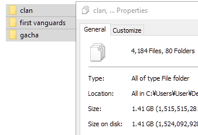

# Vanguard Zero Card Image Downloader

Download card images from Vanguard Zero's official database.

The downloaded images are for non-commercial and personal use only.

# Context

Vanguard Zero is a mobile card game that announced its End of Service in mid-2023.

However, there are people who still want to experience the game as it was and as it could be.

An acquaintance of mine wanted to play the game with a few friends, and for that, he needed the card images.

Downloading the cards manually took a lot of time and effort. It took him 3 hours to download 100 images.

Thus, I created this script to facilitate the download process.

# Results

1. Development and Testing took 17 hours in total.
2. Deployment: It took 11 hours to download 4184 images.
3. This means the program can **download 100 images in 16 minutes vs. 3 hours when done manually**. 
4. This resulted in 91% less time spent on the task. 

# Examples of the Script in Action

Download started:

Download finished:

Sample downloaded images:

# Software Information

- Written in Python 3.12.

# Version History

1. Version 1.0 was a semi-auto version that required a lot of manual work to use.
2. Version 2.0 was a fully automatic version that only needed the URL of the webpage.
3. Version 2.1 used a double looping method that may have inefficiencies.
4. Version 2.2 changed the double looping method into a more efficient approach.